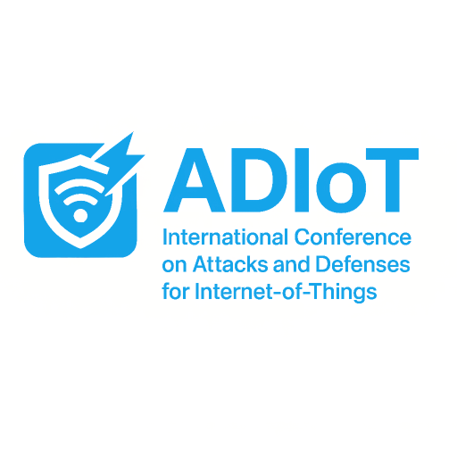

# ADIoT

International Conference / Workshop on <b>A</b>ttacks and <b>D</b>efense for <b>I</b>nternet-<b>o</b>f-<b>T</b>hings Website

## Ongoing ADIoT Event
- [ADIoT Conference 2025](https://adiot.sptagelab.org/2025/) Changzhou, China.

## Past ADIoT Events
- [ADIoT Conference 2024](https://adiot.sptagelab.org/2024/) Hangzhou, China.
- [ADIoT Workshop 2023](https://adiot.sptagelab.org/2023/) Hague, Netherlands.
- [ADIoT Workshop 2022](https://adiot.sptagelab.org/2022/) Copenhagen, Denmark.
- [ADIoT Workshop 2021](https://adiot.sptagelab.org/2021/) Darmstadt, Germany.
- [ADIoT Workshop 2020](https://adiot.sptagelab.org/2020/) Surrey, United Kingdom.
- [ADIoT Workshop 2019](https://adiot.sptagelab.org/2019/) Luxembourg.
- [ADIoT Workshop 2018](https://cns2018.ieee-cns.org/workshop/adiot-international-workshop-attacks-and-defenses-internet-things-0.html) Beijing, China.